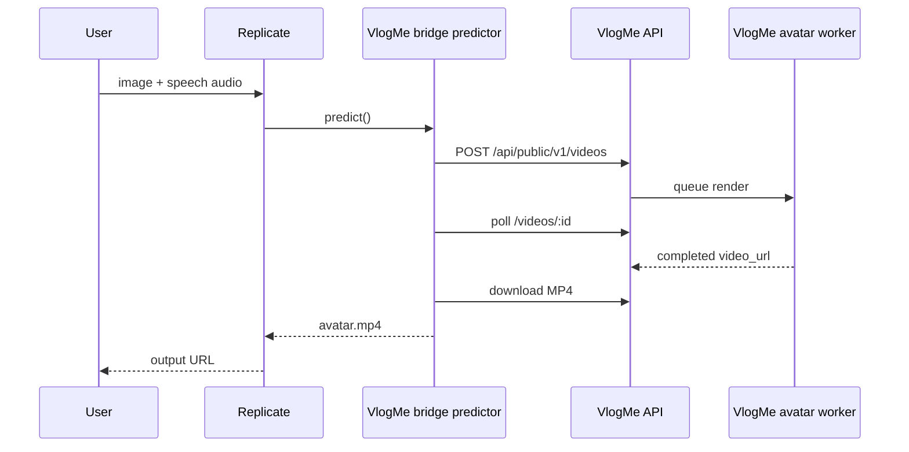

# Architecture

## Public Bridge

The public Replicate model is intentionally small:

```text
avatar image + speech audio -> VlogMe render job -> avatar MP4
```

The bridge image runs on CPU. It does not bundle model weights and does not run
the full avatar neural network inside the Replicate container. Its job is to:

1. Receive an image and audio file from Replicate.
2. Convert those inputs into VlogMe API payloads.
3. Create a VlogMe public API render job.
4. Poll the render status until it completes or fails.
5. Download the completed MP4 and return it to Replicate.
6. Forward Replicate cancellation signals into the VlogMe job when possible.



## Public Inputs

- `avatar_image`: required image input.
- `audio`: required speech audio input.
- `live_subtitles`: optional boolean, default `true`.

The bridge always requests:

- vertical `9:16` output,
- center crop from the input image,
- top watermark `Created by VlogMe.AI`.

Aspect ratio and watermark controls are intentionally not exposed in the public
Replicate schema.

## Private Runtime Path

The repository also contains a heavy GPU Cog package:

- `run.py`
- `cog.yaml`
- `runtime/SmartBlog-Live/`

That path is for private runtime experiments and deployment work. It can run the
avatar model directly when the required weights and GPU hardware are available.
It is kept in this repository so the public bridge and the lower-level runtime
interface can evolve together.

The current heavy runtime profiles include:

- A100 2x passthrough layout: denoise on one GPU, VAE/decode/post-VAE work on
  the other GPU.
- Alternative DiT sharding modes for A/B testing.
- Environment-driven quality controls such as size, steps, face restore, FP8,
  and compile toggles.

Model weights, private server credentials, local logs, and generated outputs are
not committed.

## Deployment Strategy

For public traffic, prefer the Replicate deployment:

```text
lex2029/vlogme-avatar-bridge-cpu
```

It can be kept warm with `min_instances=1` while the actual avatar render work
stays inside the VlogMe render fleet. This gives Replicate users a simple
model-shaped API while VlogMe keeps ownership of queueing, billing checks,
post-processing, subtitles, watermarking, and cancellation.

## Future Work

- Add more public examples and stable sample outputs.
- Add optional text-to-speech as a separate public input mode.
- Keep the public schema small while exposing richer paid controls through the
  VlogMe web app and VlogMe API.
- Split the vendored runtime into a clean package once the lower-level interface
  stabilizes.
