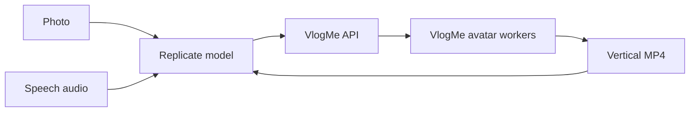

# VlogMe Avatar for Replicate

Turn a centered photo and a speech audio file into a vertical talking-avatar MP4
through Replicate.

<p align="center">
  <a href="https://replicate.com/lex2029/vlogme-avatar-bridge">
    
  </a>
  <a href="https://vlogme.ai">
    
  </a>
  <a href="https://vlogme.ai/docs/api">
    
  </a>
</p>

<p align="center">
  <a href="https://replicate.com/lex2029/vlogme-avatar-bridge">Run the public model</a>
  ·
  <a href="https://vlogme.ai">Open VlogMe.AI</a>
  ·
  <a href="https://vlogme.ai/docs/api">Read the API docs</a>
</p>

<p align="center">
  <video
    src="assets/vlogme-avatar-demo.mp4"
    width="360"
    controls
  ></video>
</p>

<p align="center">
  <a href="assets/vlogme-avatar-demo.mp4">Open the demo video</a>
</p>

## What It Does

VlogMe Avatar accepts:

- `avatar_image`: a portrait, presenter, character, or other centered face image.
- `audio`: spoken audio to animate.
- `live_subtitles`: optional word-level subtitles, enabled by default.

The output is always a vertical `9:16` MP4. VlogMe uses the center of the input
image for the final crop, so results are best when the face or presenter is near
the middle of the photo. Public Replicate generations include the top watermark
`Created by VlogMe.AI`.

## Quick Start

The fastest path is the public Replicate model page:

[replicate.com/lex2029/vlogme-avatar-bridge](https://replicate.com/lex2029/vlogme-avatar-bridge)

You can also run the included sample from this repository:

```bash
export REPLICATE_API_TOKEN="your_replicate_token"
python3 examples/run_replicate_prediction.py
```

The example uses:

- [`test_assets/friendly_ai_presenter.jpg`](test_assets/friendly_ai_presenter.jpg)
- [`test_assets/presenter_8s.wav`](test_assets/presenter_8s.wav)
- subtitles enabled

For a longer render:

```bash
python3 examples/run_replicate_prediction.py \
  --audio test_assets/presenter_30s.wav \
  --timeout-sec 2400
```

## API Example

The example script uses Replicate's HTTP API directly:

```python
payload = {
    "version": latest_version_id,
    "input": {
        "avatar_image": "data:image/jpeg;base64,...",
        "audio": "data:audio/wav;base64,...",
        "live_subtitles": True,
    },
}
```

See [`examples/`](examples/) for a complete runnable script.

## Repository Layout

```text
.
├── run_bridge.py                 # Public Replicate bridge predictor
├── cog.bridge.yaml               # Cheap CPU Cog image for the bridge
├── run.py                        # Heavy GPU avatar predictor interface
├── cog.yaml                      # Heavy GPU Cog image
├── runtime/SmartBlog-Live/       # Vendored avatar runtime snapshot
├── assets/                       # Public README demo video
├── test_assets/                  # Small public sample image/audio inputs
├── examples/                     # Public API examples
├── docs/replicate-model-readme.md
└── .github/workflows/            # Manual publish/test workflows
```

## Architecture

The public Replicate model is a lightweight bridge. It does not load model
weights inside the CPU container. Instead, it accepts files from Replicate,
creates a VlogMe render job through the VlogMe public API, waits for the render
fleet to finish, and returns the completed MP4 to Replicate.



The repository also keeps the heavier GPU Cog package used for A100/B200/B300
experiments and private runtime work. The public model currently points to the
bridge path because it is easier to keep warm, cheaper to operate, and lets the
VlogMe render fleet own post-processing, subtitles, watermarking, cancellation,
and queue behavior.

## Local Development

Bridge smoke test:

```bash
export REPLICATE_API_TOKEN="your_replicate_token"
python3 examples/run_replicate_prediction.py
```

Heavy GPU local testing requires Cog, Docker, model weights, and a GPU machine:

```bash
mkdir -p weights
cog run -i avatar_image=@/path/to/avatar.png -i audio=@/path/to/speech.wav
```

Model weights and runtime secrets are intentionally not committed.

## Maintainer Workflows

Manual GitHub Actions workflows are included for maintainers:

- `Push to Replicate`: publishes either `cog.yaml` or `cog.bridge.yaml`.
- `Update Replicate Model Metadata`: syncs the public model README/description.
- `Test Replicate Bridge Prediction`: runs a bridge smoke test.
- `Cancel Active Replicate Predictions`: cancels active predictions for a model
  or deployment.
- `Update Replicate Deployment`: updates deployment version, hardware, and warm
  instance settings.

Required GitHub Actions secrets:

- `REPLICATE_API_TOKEN`
- `REPLICATE_CLI_AUTH_TOKEN`
- `VLOGME_API_TOKEN`

Do not commit `.env` files, `.replicate_runtime/`, model weights, private server
keys, or generated logs.

## Links

- Product: [VlogMe.AI](https://vlogme.ai)
- VlogMe API docs: [vlogme.ai/docs/api](https://vlogme.ai/docs/api)
- Replicate model: [lex2029/vlogme-avatar-bridge](https://replicate.com/lex2029/vlogme-avatar-bridge)
- Replicate model README source: [`docs/replicate-model-readme.md`](docs/replicate-model-readme.md)

## License

This repository is currently source-available for the VlogMe Replicate wrapper
and deployment workflow. No open-source license is granted unless a `LICENSE`
file is added. Model weights, VlogMe service credentials, and production runtime
assets are not included.
